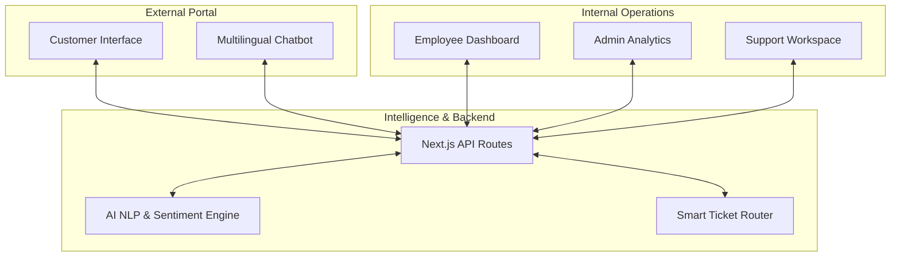

# 🌟 NeoServe — AI-Powered Unified Service Experience

[](https://nextjs.org/)
[](https://reactjs.org/)
[](https://tailwindcss.com/)
[](https://ui.shadcn.com/)

**NeoServe** is a comprehensive, full-stack platform designed to revolutionize customer support and employee well-being. By integrating advanced artificial intelligence, NeoServe bridges the gap between external customer inquiries and internal team management, ensuring a seamless, highly efficient service experience.

---

## 💎 Core Value Proposition

| Feature | Description | Target Audience |
|---|---|---|
| **Intelligent Routing** | Automatic assignment of tickets based on category and urgency. | **Support Team** |
| **Sentiment Analysis** | Real-time emotional detection to prioritize frustrated customers. | **Customers & Support** |
| **Smart Chat Responses** | Context-aware, AI-generated suggestions for faster resolution. | **Support Team** |
| **Multilingual Support** | Break language barriers with real-time chatbot translation. | **Customers** |
| **Employee Wellbeing** | Built-in mood tracking to monitor and support team health. | **Employees & Admins** |

---

## 🏗️ System Architecture

NeoServe operates on a modern, decoupled architecture designed for scale and exceptional user experience.



---

## 🚀 Key Workflows

Our system operates via specialized modules tailored for different user roles:

*   **Customer Portal**: Offers a frictionless experience with multi-language chatbots, file uploads for visual troubleshooting, and real-time status updates on tickets.
*   **Support Team Workspace**: Equips agents with a live chat interface, enriched by AI-powered reply suggestions and instant sentiment analysis of incoming messages.
*   **Employee Dashboard**: A personal hub for managing assigned tickets, interacting with an internal AI assistant, and logging daily mood/wellness metrics.
*   **Admin Command Center**: Provides comprehensive oversight with SLA compliance tracking, CSAT score aggregation, and holistic team performance analytics.

---

## 🛠️ Technology Stack

*   **Frontend**: Next.js 14, React, Tailwind CSS, shadcn/ui
*   **Backend**: Next.js API Routes (Serverless Architecture)
*   **Data Visualization**: Recharts for dynamic analytics
*   **UI Assets**: Lucide React (Icons), Dark Mode Support natively built-in

---

## 🔐 Quick Access (Demo Credentials)

Experience the platform from different perspectives:

| Role | Email | Password |
| :--- | :--- | :--- |
| **Admin** | `admin@company.com` | `admin123` |
| **Employee** | `john.doe@company.com` | `demo123` |
| **Customer** | *No login required* | *Direct Access* |

---

## ⚙️ Development Setup

Ready to contribute or deploy your own instance? Follow these steps:

### 1. Synchronize the Repository
```bash
git clone https://github.com/Varshiniamara/NeoServe.git
cd NeoServe
```

### 2. Install Dependencies
```bash
npm install
```

### 3. Launch Development Server
```bash
npm run dev
```

### 4. Access the Application
Navigate to `http://localhost:3000` in your preferred browser.

---

## 🌐 Deployment Details

**NeoServe** is optimized for Vercel deployment:
1. Connect your GitHub repository to Vercel.
2. Deploy using the default Next.js framework preset.
3. Your API routes will automatically deploy as serverless functions.
*(For production data, integrating a database like PostgreSQL via Prisma or MongoDB is recommended to replace the mock JSON data endpoints.)*

