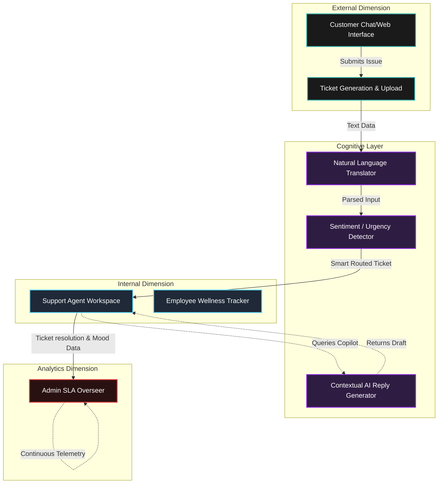

<div align="center">

# 🌟 NeoServe: AI-Powered Unified Service Platform
**Elevating Customer Experience and Employee Well-being via Intelligent Orchestration**

[](https://nextjs.org/)
[](https://reactjs.org/)
[](https://tailwindcss.com/)
[](https://ui.shadcn.com/)

*NeoServe is a masterfully engineered, end-to-end service experience platform. It dissolves the barrier between incoming customer queries and internal agent fulfillment through context-aware artificial intelligence, multi-lingual flexibility, and holistic employee management.*

---
</div>

## 📖 1. The Core Philosophy

Traditional CRM systems fail to acknowledge the parallel relationship between **Customer Satisfaction (CSAT)** and **Employee Well-being**. NeoServe bridges this gap by offering a cohesive dashboard ecosystem. While customers enjoy automated, frictionless multi-language support, internal staff are empowered with AI-generated response suggestions, predictive sentiment analysis routing, and built-in physiological/mental tracking mechanisms.

---

## 🎯 2. Feature Architecture

Our modular system is divided into three major interactive nodes:

### 🛍️ The External "Customer" Portal
*   **🌍 Real-Time Multi-Lingual Engine:** Fluid, low-latency chatbot support that automatically translates context across different global languages.
*   **📸 Visual Troubleshooting Data:** High-resolution file upload handlers allowing end-users to send error screenshots directly to the triage queue.
*   **🎫 Transparent Ticket Logging:** Real-time visibility into issue status, resolution path, and assignment.

### 💼 The Internal "Employee" Hub
*   **🧠 Intelligent Copilot Chat:** Support agents are never alone; an integrated AI assistant parses user history and generates context-aware draft responses.
*   **🌱 Wellness & Mood Tracking:** The platform requests daily emoji-based mood inputs. Admins can monitor burnout thresholds directly inside the analytics UI.
*   **⚡ Automated Smart Routing:** Incoming tickets are automatically processed by an NLP engine to detect urgency/category, assigning the ticket to the most relevant available employee.

### 🛡️ The Admin Command Center
*   **📊 Holistic Data Telemetry:** A birds-eye view rendered via interactive Recharts integrations.
*   **📈 SLA & Metrics Enforcement:** Strict visual and programmatic oversight of CSAT scores, response times, and individual team member metrics.

---

## 🏗️ 3. Platform Architecture Flow

<details>
<summary><b>Click to Expand: Mermaid Architecture Diagram</b></summary>



</details>

---

## 🔌 4. Tech Stack & Integration Points

*   **Core UI Runtime:** Next.js 14 (App Router) bridging React 18 primitives.
*   **Design Typography & Layout:** Tailwind CSS coupled with Shadcn/UI (Radix-driven headless components).
*   **Data Transport:** Serverless Next.js API Routes operating directly alongside edge-rendered pages.
*   **Visualizations:** Recharts for dynamic, low-overhead analytics graphs.
*   **Vector Iconography:** Lucide-React ensuring sharp, scalable icons across the dark-mode compatible interface.

---

## 🔐 5. Platform Accessibility (Interactive Demo context)

For testing purposes within the local or deployed environments, use the built-in demo credentials to immediately explore the respective interfaces:

| Access Tier | E-Mail | Secure Password | Portal Access |
| :--- | :--- | :--- | :--- |
| **System Admin** | `admin@company.com` | `admin123` | *Analytics & Oversight Hub* |
| **Support Employee** | `john.doe@company.com` | `demo123` | *Agent Workspace & Copilot* |
| **Global Customer** | *No Authentication* | *Direct Entry* | *Public Support Applet* |

---

## ⚙️ 6. Seamless Local Engineering Setup

Execute these terminal commands to replicate NeoServe directly on your machine.

**Step 1. Asset Retrieval**
```bash
git clone https://github.com/Varshiniamara/NeoServe.git
cd NeoServe
```

**Step 2. Dependency Allocation**  
Ensure you have Node.js and NPM running, then execute:
```bash
npm install
```

**Step 3. Ignite the Compilation Server**  
Launch the development engine with Hot-Module-Reloading active:
```bash
npm run dev
```

**Step 4. Access the Nexus**  
Open your preferred web client and navigate to `http://localhost:3000`.

---

## 🚀 7. Production Deployment (Vercel)

NeoServe's Next.js infrastructure is natively targeted for immediate deployment on the Vercel edge network:
1. Connect your GitHub repository target within the Vercel Dashboard.
2. Select the framework preset `Next.js`.
3. Vercel automatically infers all static builds and transforms API routes `/api/*` into auto-scaled Serverless functions.

---
<div align="center">
  <b>Architecting the next century of digital relationships.</b><br>
  Built with ❤️ by the NeoServe Development Initiative.
</div>
